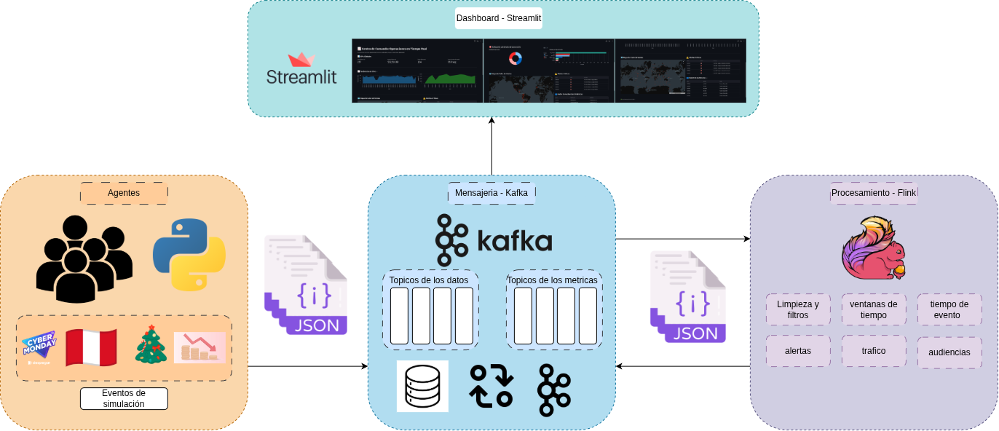

# Simul Sales Stream & Real-Time Analytics Pipeline

Sistema de simulación de flujos de compra en tiempo real, procesamiento analítico distribuido y visualización de inteligencia de negocio. Utiliza **Apache Kafka** como backbone de mensajería, **Apache Flink (PyFlink)** para el procesamiento continuo (stateful) y **Streamlit** para el monitoreo de KPIs y audiencias digitales. Todo el ecosistema está diseñado para ser desplegado de forma automatizada en un clúster de AWS EC2.

---

# Stack de Tecnologías y Versiones

| Componente | Versión | Notas |
|------------|----------|-------|
| Apache Kafka | **4.3.1** (Scala 2.13) | Modo **KRaft** |
| Apache Flink | **1.18.1** | Motor de procesamiento distribuido (Table API) |
| Python | **3.10 / 3.11** | Entorno virtual estricto para evitar colisión de versiones |
| confluent-kafka | **2.15.0** | Cliente Kafka para Python |
| PyFlink | **1.18.1** | API de Python para Apache Flink |
| Streamlit | Latest | Framework de UI para el dashboard en tiempo real |
| Pandas | **2.3.3** | Manipulación de datos en memoria para UI |
| Faker & NumPy | **40.36.0 / 1.24.4** | Generación de datos sintéticos estadísticos |

---

# Arquitectura del Sistema

La arquitectura está dividida en tres capas principales operando sobre un clúster de nodos EC2 (Maestro y Trabajadores):

## 1. Capa de Ingesta (Simulador → Kafka)

Generación concurrente de miles de agentes con perfiles específicos, inyectando eventos JSON a tópicos crudos en Kafka.

## 2. Capa de Procesamiento (PyFlink)

Motor analítico que lee los tópicos crudos, agrupa la información mediante ventanas de tiempo (*Time Windows*) y aplica reglas de negocio (*Stateful Processing*) para calcular métricas e identificar audiencias en paralelo usando un **StatementSet**.

## 3. Capa de Visualización (Streamlit)

Consumidor web que lee los tópicos de métricas ya procesados y renderiza gráficos interactivos actualizados en milisegundos.


---

# Tópicos Crudos (Entrada)

| Topic | Particiones | Replicación | Descripción |
|--------|------------:|------------:|-------------|
| `store.busqueda` | 6 | 2 | Eventos de búsquedas genéricas |
| `store.ver_producto` | 6 | 2 | Visualizaciones de productos específicos |
| `store.telemetria` | 6 | 2 | Datos de latitud/longitud y dispositivos |
| `store.login` | 4 | 2 | Inicios de sesión de usuarios |
| `store.agregar_carrito` | 4 | 2 | Intenciones de compra |
| `store.eliminar_carrito` | 4 | 2 | Remociones de productos |
| `store.compra` | 3 | 2 | Transacciones generadas |
| `store.pago` | 3 | 2 | Intentos de pago (exitosos/fallidos) |
| `store.abandono` | 3 | 2 | Abandono de flujo de compra |

---

# Tópicos de Métricas (Salida - Generados por Flink)

| Topic | Particiones | Replicación | Descripción |
|--------|------------:|------------:|-------------|
| `dashboard.trafico` | 3 | 2 | Throughput de eventos por segundo (Ventanas de 5 s) |
| `dashboard.negocio` | 3 | 2 | Revenue y conteo de tickets (Ventanas de 1 min) |
| `dashboard.audiencias` | 4 | 2 | Clasificación de usuarios (Explorador, Premium) |
| `dashboard.alertas` | 2 | 2 | Picos de pagos fallidos y abandonos anómalos |

---

# Estructura del Proyecto

```text
simul_sales_stream/
├── aws_exports.sh                   # Variables de entorno exportadas (AWS)
├── nodos_info.json                  # Mapeo de IPs públicas/privadas del clúster
├── credenciales.txt                 # Credenciales AWS (no versionada)
├── labsuser.pem                     # Llave SSH para EC2 (no versionada)
├── requirements.txt                 # Dependencias Python
│
├── Simulador & Kafka
│   ├── levantar_ec2_kafka.py        # Provisión del clúster Kafka EC2
│   ├── extraer_credenciales.py      # Parser de credenciales
│   └── simulador_compradores.py     # Generador principal de agentes
│
├── Procesamiento (Flink)
│   ├── flink_procesamiento_total.py # Script unificado de Table API (StatementSet)
│   ├── 6_crear_topicos_metricas.py  # Aprovisionamiento de tópicos de salida
│   └── 7_desplegar_flink.py         # Script de despliegue remoto de Flink
│
└── Dashboard (Streamlit)
    ├── dashboard.py                 # Aplicación web de métricas en tiempo real
    ├── consumidor_dashboard.py      # Cliente de prueba CLI para métricas
    └── 8_desplegar_dashboard.py     # Despliegue de dependencias y UI en EC2
```

---

# Guía de Despliegue Completo

El proyecto utiliza un enfoque de despliegue estricto con **rutas absolutas** hacia un entorno virtual aislado (`/home/ubuntu/simulador_env`) en el Nodo Maestro para evitar el clásico problema de colisión de binarios en Linux (Python 3.10 vs 3.12).

---

## 1. Preparación Local

```bash
python3 -m venv venv
source venv/bin/activate
pip install -r requirements.txt

python extraer_credenciales.py
source aws_exports.sh
```

---

## 2. Levantar Infraestructura y Kafka

```bash
# Provisión de EC2 y Kafka KRaft
python levantar_ec2_kafka.py
```

---

## 3. Ingesta de Datos (Simulador)

Sube y ejecuta el simulador asegurando el entorno aislado.

```bash
# Sube el código y configura el simulador_env en el Maestro
python 5_desplegar_simulador.py

# En la terminal del Maestro
/home/ubuntu/simulador_env/bin/python \
/home/ubuntu/simulador_compradores.py \
    --agentes 500 \
    --workers 2 \
    --velocidad 100
```

---

## 4. Procesamiento Distribuido (Apache Flink)

Mientras el simulador genera tráfico, despliega las tuberías analíticas.

```bash
# Crear tópicos de métricas
python 6_crear_topicos_metricas.py

# Desplegar Flink
python 7_desplegar_flink.py

# Ejecutar el Job de PyFlink
/home/ubuntu/flink/bin/flink run \
    -pyclientexec /home/ubuntu/simulador_env/bin/python \
    -pyexec /home/ubuntu/simulador_env/bin/python \
    -py /home/ubuntu/flink_procesamiento_total.py
```

---

## 5. Visualización en Vivo (Dashboard Streamlit)

```bash
# Preparar la interfaz
python 8_desplegar_dashboard.py

# Levantar Streamlit
/home/ubuntu/simulador_env/bin/streamlit run \
    /home/ubuntu/dashboard.py
```

> **Nota de red:** asegúrate de que el **Security Group** del Nodo Maestro tenga abierto el puerto **TCP 8501** para acceder al dashboard desde el navegador.

```
http://<IP_MAESTRO>:8501
```

---

# Detalles de Procesamiento en Flink

El script `flink_procesamiento_total.py` está optimizado para ejecutar múltiples consultas SQL dentro de un único **StatementSet**.

En lugar de lanzar varios Jobs independientes (lo que consumiría innecesariamente los *Task Slots* del clúster), todas las consultas se agrupan en un único grafo de ejecución (DAG). De esta manera, Flink:

- Lee cada tópico de entrada una sola vez.
- Comparte el mismo flujo de datos entre múltiples consultas SQL.
- Ejecuta procesamiento **stateful** de forma distribuida.
- Reduce el consumo de recursos del clúster.
- Maximiza el paralelismo y el throughput del pipeline.

Este enfoque permite escalar el procesamiento de eventos en tiempo real manteniendo una utilización eficiente de CPU, memoria y ancho de banda dentro del clúster.
